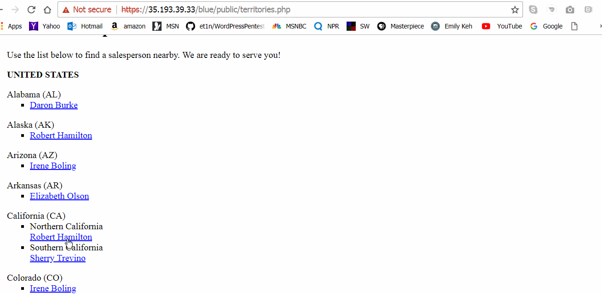
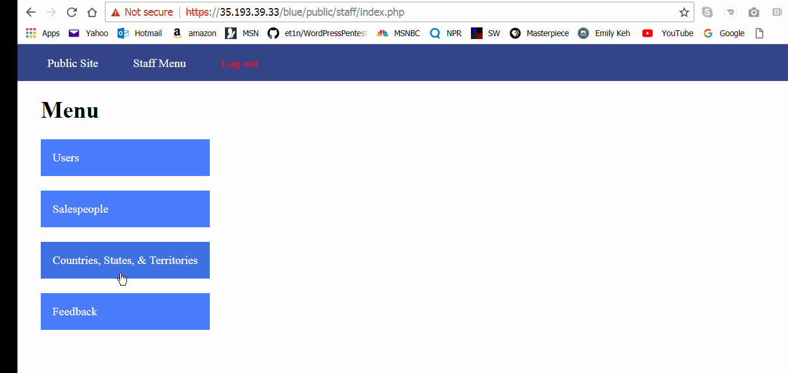
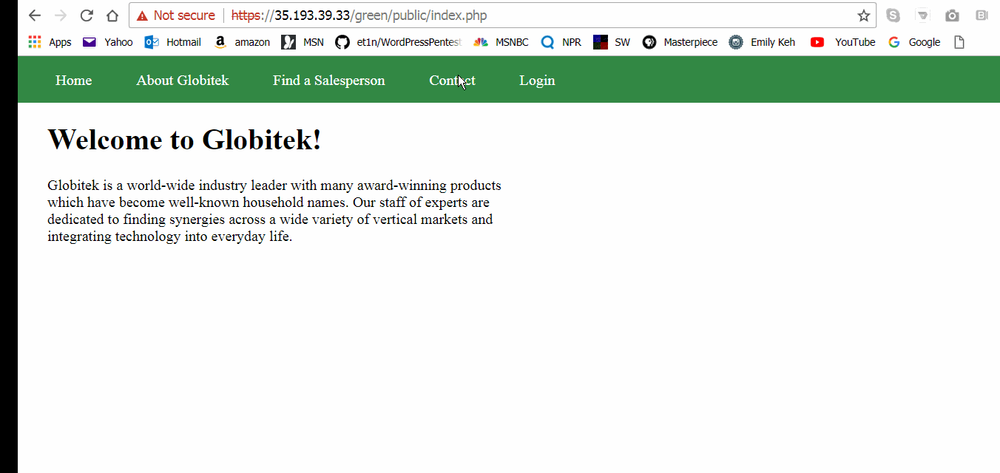
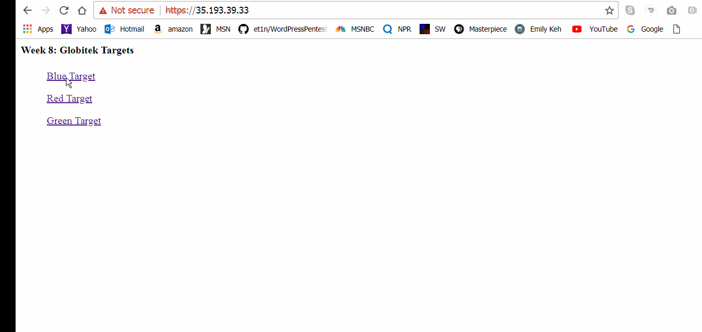
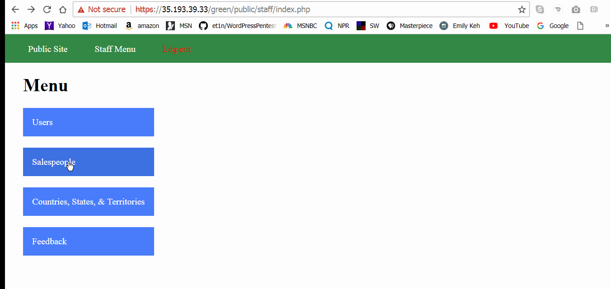
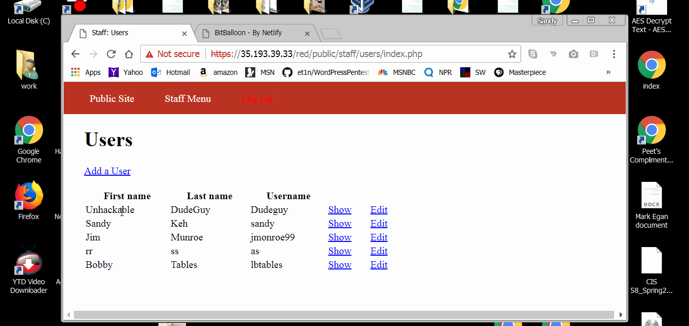

# Pentesting-Live-Targets-
week8
# Week 8 - Pentesting Live Targets

Time spent: **9** hours spent in total

> Objective: Identify vulnerabilities in three different versions of the Globitek website: blue, green, and red.

The six possible exploits are:
* Username Enumeration
* Insecure Direct Object Reference (IDOR)
* SQL Injection (SQLi)
* Cross-Site Scripting (XSS)
* Cross-Site Request Forgery (CSRF)
* Session Hijacking/Fixation

Each version of the site has been given two of the six vulnerabilities. (In other words, all six of the exploits should be assignable to one of the sites.)

## Blue

Vulnerability #1: 
SQL Injection - I first tried to do an injection with '1=1'  which is what I always do.  Then I went to other injections and the one that worked was 
worked was 'or sleep(7)=0--"

Vulnerability #2: Session Hijacking/fixation:  In this vunerability I opened up two browsers, Chrome and Firefox.  In Chrome, I logged into the blue site with my username and password.  I then pasted this script public/hacktools/change_session_id.php at the url to get the session id   eg72g2p6rim5tt1fic19f1plb5.  I went to the Firefox and to the Green site but I didn't log in.  I again pasted the script to get to the session ID.  I pasted the session id I got from the blue site in the session id area for the green site and hit change.  That allowed me to log into the site.

## Green

Vulnerability #1: This was a cross-site scripting vunerability.  I put a username and email in the contact area of the site.  Then I did a XSS in the comment area.  Logged into the site as pperson and clicked on feedback and I got sxx sign.

Vulnerability #2: This vunerability is username enumeration.  I went to all the sites and I enter my username pperson.  I then typed in a password that I made up.  On all the sites I got login was unsucessful in bold.  When I typed in a fake username and fake password in the Red and Blue sites, I got login was unsuccessful in bold.  But on the green site, login was unsuccessful was not bold when I typed in the fake username and password.

## Red

Vulnerability #1:I was logged into the green site as pperson and when I went to the menu and Sales people there were two interesting Sales people.  Lazy Lazyman and Testy McTesterson so I clicked on show and found that they have id = 10 and 11.  I went to the sites and put in there Id numbers. On the green and blue site, I couldn't see them. On the red site I could find them by putting their number at the top after I selected a sales person.

Vulnerability #2:Cross-Site Request Forgery: One of the three sites does not have CSRF protections on the admin area.  This was really hard for me but what I did was create a script in notepad to change a user when a person loads a different site.  In this case a video.

## Notes

Describe any challenges encountered while doing the work
